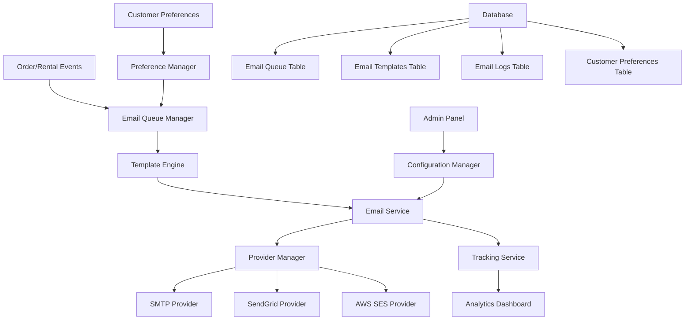

# Email Notifications System Design

## Overview

The email notifications system provides comprehensive automated email communication for the Mahalakshmi Imitation Jewellery e-commerce platform. The system handles transactional emails (order confirmations, status updates), operational emails (rental reminders, admin notifications), and provides robust delivery mechanisms with fallback support.

### Key Design Principles

- **Asynchronous Processing**: Email sending never blocks critical business operations
- **Reliability**: Multiple provider support with automatic failover
- **Scalability**: Queue-based architecture handles high-volume periods
- **Maintainability**: Template-driven approach with clear separation of concerns
- **Monitoring**: Comprehensive tracking and analytics for delivery optimization

### Integration Approach

The system integrates seamlessly with existing Node.js/Express architecture through:
- Enhanced email service with queue management
- Database schema extensions for tracking and preferences
- Middleware integration in existing order/rental workflows
- Admin panel extensions for configuration and monitoring

## Architecture

### System Components



### Component Responsibilities

**Email Queue Manager**
- Manages asynchronous email processing
- Prioritizes transactional over promotional emails
- Implements retry logic with exponential backoff
- Provides queue monitoring and health checks

**Template Engine**
- Renders HTML emails from templates and data
- Supports responsive design for mobile clients
- Maintains brand consistency across all communications
- Validates template syntax and data binding

**Provider Manager**
- Abstracts email provider implementations
- Implements automatic failover between providers
- Manages provider-specific configurations
- Tracks provider performance metrics

**Tracking Service**
- Records delivery status and engagement metrics
- Provides bounce and complaint handling
- Generates performance reports
- Alerts on delivery issues

## Components and Interfaces

### Enhanced Email Service

```javascript
class EmailService {
  constructor(config) {
    this.queueManager = new EmailQueueManager(config.queue);
    this.templateEngine = new TemplateEngine(config.templates);
    this.providerManager = new ProviderManager(config.providers);
    this.trackingService = new TrackingService(config.tracking);
  }

  async sendOrderConfirmation(order, options = {}) {
    return this.queueEmail('order_confirmation', {
      to: order.customer_email,
      data: order,
      priority: 'high',
      ...options
    });
  }

  async sendStatusUpdate(order, newStatus, options = {}) {
    return this.queueEmail('order_status_update', {
      to: order.customer_email,
      data: { order, newStatus },
      priority: 'high',
      ...options
    });
  }

  async sendRentalReminder(rental, reminderType, options = {}) {
    return this.queueEmail(`rental_${reminderType}`, {
      to: rental.customer_email,
      data: rental,
      priority: 'medium',
      ...options
    });
  }

  async sendAdminNotification(type, data, options = {}) {
    const adminEmails = await this.getAdminEmails();
    return Promise.all(adminEmails.map(email => 
      this.queueEmail(`admin_${type}`, {
        to: email,
        data,
        priority: type === 'high_value_order' ? 'high' : 'medium',
        ...options
      })
    ));
  }
}
```

### Email Queue Manager

```javascript
class EmailQueueManager {
  constructor(config) {
    this.db = config.database;
    this.workers = config.workers || 3;
    this.retryAttempts = config.retryAttempts || 3;
    this.retryDelay = config.retryDelay || 1000;
  }

  async queueEmail(type, emailData) {
    const queueItem = {
      id: generateId(),
      type,
      recipient: emailData.to,
      data: JSON.stringify(emailData.data),
      priority: this.getPriorityValue(emailData.priority),
      status: 'queued',
      attempts: 0,
      created_at: new Date(),
      scheduled_for: emailData.scheduledFor || new Date()
    };

    await this.db.query(
      'INSERT INTO email_queue (id, type, recipient, data, priority, status, attempts, created_at, scheduled_for) VALUES ($1, $2, $3, $4, $5, $6, $7, $8, $9)',
      Object.values(queueItem)
    );

    return queueItem.id;
  }

  async processQueue() {
    const items = await this.getQueuedItems();
    const workers = items.slice(0, this.workers).map(item => 
      this.processQueueItem(item)
    );
    
    await Promise.allSettled(workers);
  }

  async processQueueItem(item) {
    try {
      await this.updateItemStatus(item.id, 'processing');
      
      const emailData = JSON.parse(item.data);
      const result = await this.emailService.sendEmail(item.type, emailData);
      
      await this.updateItemStatus(item.id, 'sent', { 
        sent_at: new Date(),
        provider_response: result 
      });
      
      await this.trackingService.recordDelivery(item.id, 'sent', result);
      
    } catch (error) {
      await this.handleFailure(item, error);
    }
  }
}
```

### Template Engine

```javascript
class TemplateEngine {
  constructor(config) {
    this.templatesPath = config.path;
    this.cache = new Map();
    this.brandConfig = config.brand;
  }

  async renderTemplate(templateName, data) {
    const template = await this.getTemplate(templateName);
    const context = {
      ...data,
      brand: this.brandConfig,
      currentYear: new Date().getFullYear(),
      formatCurrency: this.formatCurrency,
      formatDate: this.formatDate
    };

    return this.processTemplate(template, context);
  }

  async getTemplate(name) {
    if (this.cache.has(name)) {
      return this.cache.get(name);
    }

    const template = await this.loadTemplate(name);
    this.cache.set(name, template);
    return template;
  }

  formatCurrency(amount) {
    return new Intl.NumberFormat('en-IN', {
      style: 'currency',
      currency: 'INR'
    }).format(amount);
  }
}
```

### Provider Manager

```javascript
class ProviderManager {
  constructor(config) {
    this.providers = this.initializeProviders(config);
    this.currentProvider = 0;
    this.failureThreshold = config.failureThreshold || 3;
    this.failureCounts = new Map();
  }

  async sendEmail(emailData) {
    let lastError;
    
    for (let attempt = 0; attempt < this.providers.length; attempt++) {
      const provider = this.getCurrentProvider();
      
      try {
        const result = await provider.send(emailData);
        this.recordSuccess(provider.name);
        return result;
      } catch (error) {
        lastError = error;
        this.recordFailure(provider.name);
        this.switchToNextProvider();
      }
    }
    
    throw new Error(`All providers failed. Last error: ${lastError.message}`);
  }

  initializeProviders(config) {
    const providers = [];
    
    if (config.smtp) {
      providers.push(new SMTPProvider(config.smtp));
    }
    
    if (config.sendgrid) {
      providers.push(new SendGridProvider(config.sendgrid));
    }
    
    if (config.ses) {
      providers.push(new AWSProvider(config.ses));
    }
    
    return providers;
  }
}
```

## Data Models

### Database Schema Extensions

```sql
-- Email queue for asynchronous processing
CREATE TABLE email_queue (
  id VARCHAR(36) PRIMARY KEY,
  type VARCHAR(50) NOT NULL,
  recipient VARCHAR(255) NOT NULL,
  data JSONB NOT NULL,
  priority INTEGER DEFAULT 5,
  status VARCHAR(20) DEFAULT 'queued',
  attempts INTEGER DEFAULT 0,
  created_at TIMESTAMP DEFAULT NOW(),
  scheduled_for TIMESTAMP DEFAULT NOW(),
  sent_at TIMESTAMP NULL,
  error_message TEXT NULL,
  provider_response JSONB NULL
);

-- Email templates storage
CREATE TABLE email_templates (
  id SERIAL PRIMARY KEY,
  name VARCHAR(100) UNIQUE NOT NULL,
  subject VARCHAR(255) NOT NULL,
  html_content TEXT NOT NULL,
  text_content TEXT NULL,
  variables JSONB NULL,
  is_active BOOLEAN DEFAULT true,
  created_at TIMESTAMP DEFAULT NOW(),
  updated_at TIMESTAMP DEFAULT NOW()
);

-- Email delivery tracking
CREATE TABLE email_logs (
  id VARCHAR(36) PRIMARY KEY,
  queue_id VARCHAR(36) REFERENCES email_queue(id),
  recipient VARCHAR(255) NOT NULL,
  subject VARCHAR(255) NOT NULL,
  template_name VARCHAR(100) NOT NULL,
  provider VARCHAR(50) NOT NULL,
  status VARCHAR(20) NOT NULL,
  sent_at TIMESTAMP NOT NULL,
  delivered_at TIMESTAMP NULL,
  opened_at TIMESTAMP NULL,
  clicked_at TIMESTAMP NULL,
  bounced_at TIMESTAMP NULL,
  complaint_at TIMESTAMP NULL,
  provider_message_id VARCHAR(255) NULL,
  error_details JSONB NULL
);

-- Customer notification preferences
CREATE TABLE customer_email_preferences (
  id SERIAL PRIMARY KEY,
  customer_id INTEGER REFERENCES customers(id),
  email VARCHAR(255) NOT NULL,
  order_confirmations BOOLEAN DEFAULT true,
  status_updates BOOLEAN DEFAULT true,
  rental_reminders BOOLEAN DEFAULT true,
  promotional_emails BOOLEAN DEFAULT true,
  unsubscribe_token VARCHAR(100) UNIQUE,
  created_at TIMESTAMP DEFAULT NOW(),
  updated_at TIMESTAMP DEFAULT NOW()
);

-- Email configuration settings
CREATE TABLE email_settings (
  id SERIAL PRIMARY KEY,
  setting_key VARCHAR(100) UNIQUE NOT NULL,
  setting_value JSONB NOT NULL,
  description TEXT NULL,
  updated_at TIMESTAMP DEFAULT NOW()
);

-- Indexes for performance
CREATE INDEX idx_email_queue_status_priority ON email_queue(status, priority DESC, scheduled_for);
CREATE INDEX idx_email_queue_scheduled ON email_queue(scheduled_for) WHERE status = 'queued';
CREATE INDEX idx_email_logs_recipient ON email_logs(recipient);
CREATE INDEX idx_email_logs_sent_at ON email_logs(sent_at);
CREATE INDEX idx_customer_preferences_email ON customer_email_preferences(email);
```

### Data Transfer Objects

```javascript
// Order confirmation email data
const OrderConfirmationData = {
  order: {
    id: 'string',
    orderId: 'string',
    total: 'number',
    status: 'string',
    placedAt: 'Date',
    items: [{
      name: 'string',
      quantity: 'number',
      price: 'number',
      mode: 'string'
    }]
  },
  customer: {
    name: 'string',
    email: 'string',
    phone: 'string',
    address: 'string'
  },
  estimatedDelivery: 'Date',
  trackingReference: 'string'
};

// Rental reminder data
const RentalReminderData = {
  rental: {
    orderId: 'string',
    items: 'Array',
    pickupDate: 'Date',
    returnDate: 'Date',
    location: 'string'
  },
  customer: {
    name: 'string',
    email: 'string',
    phone: 'string'
  },
  reminderType: 'pickup|return|overdue',
  daysUntilDue: 'number'
};
```

## Correctness Properties

*A property is a characteristic or behavior that should hold true across all valid executions of a system-essentially, a formal statement about what the system should do. Properties serve as the bridge between human-readable specifications and machine-verifiable correctness guarantees.*

### Property 1: Order confirmation email timing

*For any* customer order placement, the email service should queue an order confirmation email within 30 seconds of order creation.

**Validates: Requirements 1.1**

### Property 2: Order confirmation content completeness

*For any* order confirmation email, the rendered template should include order ID, customer details, itemized product list, total amount, and estimated delivery date.

**Validates: Requirements 1.2**

### Property 3: Email branding consistency

*For any* email template rendered by the system, the output should include Mahalakshmi branding elements (logo, colors, contact information).

**Validates: Requirements 1.3, 6.3**

### Property 4: Invalid email error handling

*For any* order with an invalid customer email address, the email service should log the error and continue order processing without failure.

**Validates: Requirements 1.4**

### Property 5: Tracking reference uniqueness

*For any* two confirmation emails sent by the system, they should have different tracking reference identifiers.

**Validates: Requirements 1.5**

### Property 6: Status change email triggering

*For any* order status change to confirmed, shipped, delivered, or cancelled, the email service should queue a status update email.

**Validates: Requirements 2.1**

### Property 7: Status update content completeness

*For any* status update email, the rendered template should include current status, expected next steps, and relevant tracking information.

**Validates: Requirements 2.2**

### Property 8: Duplicate notification prevention

*For any* order that receives the same status change multiple times, only one email notification should be sent for that status.

**Validates: Requirements 2.5**

### Property 9: Rental reminder scheduling

*For any* rental with pickup or return dates, the email service should automatically schedule reminder emails 24 hours before the due date.

**Validates: Requirements 3.1, 3.2, 3.5**

### Property 10: Overdue rental detection

*For any* rental that is overdue by 1 day, the email service should send an overdue notice email.

**Validates: Requirements 3.3**

### Property 11: Admin notification timing

*For any* new order placement, the email service should send admin notification emails within 60 seconds.

**Validates: Requirements 4.1**

### Property 12: High-value order priority

*For any* order with total amount above ₹50,000, the email service should send a priority admin notification.

**Validates: Requirements 4.2**

### Property 13: Multi-admin notification distribution

*For any* admin notification when multiple admin emails are configured, all configured admin addresses should receive the notification.

**Validates: Requirements 4.4**

### Property 14: Receipt email triggering

*For any* order marked as delivered, the email service should send a receipt email with invoice details.

**Validates: Requirements 5.1**

### Property 15: PDF invoice attachment

*For any* receipt email sent by the system, it should include a PDF invoice as an attachment.

**Validates: Requirements 5.3**

### Property 16: Currency formatting consistency

*For any* email containing currency amounts, all amounts should be formatted according to Indian standards (₹ symbol, comma separators).

**Validates: Requirements 5.5**

### Property 17: Template dynamic content substitution

*For any* email template with dynamic placeholders, the template engine should correctly substitute all placeholders with provided data.

**Validates: Requirements 6.1**

### Property 18: Template validation

*For any* template submitted to the template engine, invalid syntax should be rejected and valid syntax should be accepted.

**Validates: Requirements 6.5**

### Property 19: Email delivery retry with backoff

*For any* failed email delivery, the email service should retry with exponentially increasing delays up to the maximum retry limit.

**Validates: Requirements 7.1**

### Property 20: Provider failover

*For any* email when the primary provider fails, the email service should automatically attempt delivery through backup providers.

**Validates: Requirements 7.2, 7.3**

### Property 21: Delivery attempt logging

*For any* email sent by the system, all delivery attempts and final status should be logged for audit purposes.

**Validates: Requirements 7.4**

### Property 22: Queue persistence during outages

*For any* emails queued during service outages, they should be preserved and processed when service resumes.

**Validates: Requirements 7.5**

### Property 23: Preference-based email filtering

*For any* customer who has opted out of promotional emails, they should still receive transactional notifications but not promotional ones.

**Validates: Requirements 8.3**

### Property 24: Immediate preference application

*For any* customer preference change (opt-out), the change should take effect immediately without requiring confirmation.

**Validates: Requirements 8.5**

### Property 25: Delivery status tracking

*For any* email sent by the system, its delivery status (sent, delivered, bounced, failed) should be tracked and recorded.

**Validates: Requirements 9.1**

### Property 26: Bounce rate alerting

*For any* time period when email bounce rates exceed 5%, admin alerts should be triggered.

**Validates: Requirements 9.4**

### Property 27: TLS encryption for all transmissions

*For any* email transmission, the connection should use TLS encryption for security.

**Validates: Requirements 10.1**

### Property 28: Email address validation

*For any* email address before sending, invalid addresses should be rejected to prevent abuse.

**Validates: Requirements 10.4**

### Property 29: Asynchronous queue processing

*For any* email queued for sending, the processing should not block order creation or other critical operations.

**Validates: Requirements 11.1**

### Property 30: Queue priority handling

*For any* emails in the queue, transactional emails should be processed before promotional emails.

**Validates: Requirements 11.2**

### Property 31: Configuration validation at startup

*For any* email service configuration, invalid settings should be detected and reported at application startup.

**Validates: Requirements 12.3**

### Property 32: Graceful degradation with invalid config

*For any* invalid email configuration, the system should log warnings and disable email features without crashing.

**Validates: Requirements 12.4**

## Error Handling

### Error Categories and Responses

**Configuration Errors**
- Invalid SMTP settings: Log warning, disable email features gracefully
- Missing required environment variables: Use defaults where possible, log warnings
- Invalid template syntax: Reject template, return validation errors

**Runtime Errors**
- Network connectivity issues: Queue emails for retry, switch providers if available
- Provider API failures: Implement exponential backoff, try alternative providers
- Template rendering errors: Log error details, use fallback plain text template

**Data Validation Errors**
- Invalid email addresses: Skip sending, log validation failure
- Missing required template data: Use default values where safe, log warnings
- Malformed queue items: Move to dead letter queue, alert administrators

### Retry and Fallback Strategies

```javascript
const RetryConfig = {
  maxAttempts: 3,
  baseDelay: 1000, // 1 second
  maxDelay: 30000, // 30 seconds
  backoffMultiplier: 2,
  
  // Provider-specific retry rules
  providerRetryRules: {
    'smtp': { maxAttempts: 2, baseDelay: 2000 },
    'sendgrid': { maxAttempts: 3, baseDelay: 1000 },
    'ses': { maxAttempts: 3, baseDelay: 1500 }
  }
};

const FallbackStrategy = {
  // Template fallbacks
  templateFallback: {
    'order_confirmation': 'generic_order_email',
    'status_update': 'generic_status_email'
  },
  
  // Provider fallback order
  providerFallback: ['smtp', 'sendgrid', 'ses'],
  
  // Content fallbacks
  contentFallback: {
    htmlToText: true,
    missingDataDefaults: {
      customerName: 'Valued Customer',
      estimatedDelivery: '3-5 business days'
    }
  }
};
```

### Dead Letter Queue Management

```javascript
class DeadLetterQueueManager {
  async handleFailedEmail(emailItem, error) {
    await this.moveToDeadLetterQueue(emailItem, {
      failureReason: error.message,
      failedAt: new Date(),
      attempts: emailItem.attempts
    });
    
    await this.alertAdministrators({
      type: 'email_delivery_failure',
      emailId: emailItem.id,
      recipient: emailItem.recipient,
      error: error.message
    });
  }
  
  async processDeadLetterQueue() {
    const items = await this.getDeadLetterItems();
    
    for (const item of items) {
      if (this.shouldRetryDeadLetter(item)) {
        await this.requeueForRetry(item);
      }
    }
  }
}
```

## Testing Strategy

### Dual Testing Approach

The email notifications system requires comprehensive testing using both unit tests and property-based tests to ensure reliability and correctness.

**Unit Testing Focus:**
- Specific email template rendering with known data
- Provider failover scenarios with mocked failures
- Configuration validation with specific invalid inputs
- Queue processing with controlled timing scenarios
- Integration points with existing order/rental systems

**Property-Based Testing Focus:**
- Email content completeness across all possible order data
- Retry behavior with various failure patterns
- Template rendering with randomly generated data
- Queue prioritization with mixed email types
- Provider failover with random failure sequences

### Property-Based Testing Configuration

**Testing Library:** fast-check (JavaScript property-based testing library)
**Minimum Iterations:** 100 per property test
**Test Tagging:** Each property test must reference its design document property

Example property test structure:
```javascript
// Feature: email-notifications, Property 1: Order confirmation email timing
test('order confirmation emails are queued within 30 seconds', async () => {
  await fc.assert(fc.asyncProperty(
    orderGenerator(),
    async (order) => {
      const startTime = Date.now();
      await emailService.sendOrderConfirmation(order);
      const queueTime = Date.now() - startTime;
      
      expect(queueTime).toBeLessThan(30000);
      
      const queuedEmail = await getQueuedEmail(order.id);
      expect(queuedEmail).toBeDefined();
      expect(queuedEmail.type).toBe('order_confirmation');
    }
  ), { numRuns: 100 });
});
```

### Integration Testing Strategy

**Email Provider Integration:**
- Test with actual SMTP servers in staging environment
- Verify SendGrid and AWS SES API integrations
- Test provider failover with controlled outages

**Database Integration:**
- Test queue persistence across application restarts
- Verify email log integrity with concurrent operations
- Test customer preference updates with race conditions

**System Integration:**
- Test email triggering from actual order creation flows
- Verify rental reminder scheduling with real date calculations
- Test admin notification delivery with multiple recipients

### Performance Testing

**Load Testing Scenarios:**
- High-volume order creation (1000+ orders/minute)
- Queue processing under sustained load
- Provider failover during peak traffic
- Template rendering with large datasets

**Performance Benchmarks:**
- Email queue processing: >100 emails/second
- Template rendering: <100ms per email
- Provider failover: <5 seconds detection and switch
- Queue recovery after outage: <30 seconds

### Monitoring and Alerting Tests

**Metrics Validation:**
- Verify bounce rate calculations with known data
- Test alert triggering at configured thresholds
- Validate dashboard metrics accuracy
- Test performance report generation

**Health Check Testing:**
- Queue health endpoint accuracy
- Provider status monitoring
- Database connection health
- Template validation service availability

This comprehensive testing strategy ensures the email notifications system maintains high reliability and performance while providing confidence in its correctness across all operational scenarios.